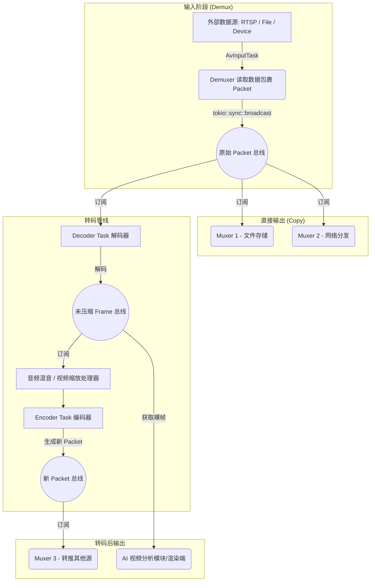

# ffmpeg-bus 音视频总线架构模块文档

`ffmpeg-bus` 是 Lite-NVR 项目中负责音视频流接入、处理、分发的核心组件。它基于 `ffmpeg-next` 构建，利用 Rust 的异步特性（Tokio）实现了高效的音视频总线系统，支持将单一来源的音视频数据解复用、解码、混音、缩放、编码并复用分发到多个输出目标。

## 1. 工程具体功能

- **多协议接入**：支持从本地文件、网络流（RTSP、RTMP、HLS）、以及本地硬件设备（如 v4l2 摄像头、x11grab 抓屏）读取音视频流。
- **动态输出分发**：支持在不中断输入源的情况下，动态添加或移除多个输出（推流到网络、保存为本地文件、获取裸数据帧等）。
- **硬件加速支持**：自动探测系统可用的硬件加速器（NVIDIA NVENC/CUVID、Intel QSV、VAAPI 等），优先使用硬件进行解码与编码，以降低 CPU 占用。
- **自动处理管线（Pipeline）**：根据输入输出的编码格式差异，自动构建 `Demuxer -> [Decoder] -> [Scaler/Mixer] -> [Encoder] -> Muxer` 的处理链。
- **混音与重采样**：内置动态音频混音器 (`audio_mixer.rs`)，支持多路音频混音。

## 2. 核心实现逻辑

整个工程围绕 `Bus`（总线）作为核心控制器展开：

1. **输入与解复用（Demuxing）**：
   - 使用 `Bus::add_input()` 添加输入配置。
   - 输入处理在一个隔离的 Toko blocking 线程中运行，通过循环读取 FFmpeg 的 Packet。
   - 读取到的数据包（`RawPacket`）立刻被发送到一条基于 `tokio::sync::broadcast` 的广播通道中（容量为 1024），用作总线上的基础“数据源”。

2. **输出与订阅（Subscribing & Pipeline Construction）**：
   - 外部调用 `Bus::add_output()` 时，`Bus` 会对比输入流和期待输出流。
   - **如果为拷贝（Copy）**：直接创建一个消费原始广播通道数据的异步任务，将 Packet 直通 Muxer。
   - **如果需要转码（Transcoding）**：`Bus` 会在内部按需挂载 Decoder 和 Encoder：
     - **Decoder Task**：订阅原始 `RawPacket` 广播，解码为 `Frame`，并发布到另一个表示解码数据的广播通道。
     - **Encoder Task**：订阅解码后的 `Frame` 广播通道，对数据进行缩放/像素格式转换后，编码成新的 `RawPacket`。
   - 每个 Output 会分配属于自己的 Muxer 消费循环，保证各输出线路相互独立。遇到单路消费慢或网络阻塞产生 `Lagged` 漏包时，允许丢包但不阻碍广播和其他输出线路。

## 3. 音视频数据流程图

以下图表展示了音视频包和帧在系统中的流动路径：



## 4. 后续修改与余留核心接口

经过最近对于 Mux 稳定性与硬件加速的支持重构，目前的核心接口结构如下：

### 核心操作生命周期：
```rust
// 1. 初始化总线环境并创建实例
ffmpeg_bus::init()?;
let mut bus = Bus::new("camera_bus");

// 2. 将输入通道进行预注册（执行 prepare_input_task）
bus.add_input(InputConfig::Net { url: "...".into() }, None).await?;

// 3. 动态按需添加输出线路（所有输出添加后，统一开启 begin_input_reading）
let (av_streams, stream_receiver) = bus.add_output(OutputConfig::new(
    "record_output".into(),
    OutputAvType::Video,
    OutputDest::File { path: "record.mp4".into() } // 也可以是 Mux, Net, Raw 裸数据
)).await?;

// 4. 清理
bus.remove_output("record_output").await?;
bus.remove_input().await?;
```

### 硬件编解码模块 (`hw.rs`):
该文件是音视频重构中整合的单例工具模块。在使用 Decoder 或 Encoder 转码时，`Bus` 会自动调用以下函数：
- `crate::hw::find_hw_decoder(codec_id)`: 给定目标解码协议（如 `H264`/`HEVC`），依次探测系统内是否存在对应的 CUDA (`cuvid`)、Intel (`qsv`) 或 Linux 原生硬件 API (`v4l2m2m`) 解码器。
- `crate::hw::find_hw_encoder(codec_name)`: 给定软编名称（如 `libx264`），按系统探测顺位返回硬件版本进行替代（如 `h264_nvenc`, `h264_vaapi` 等）。如果调用失败或设备忙碌，底层逻辑支持**热回退**到初始软件编码器。
- `crate::hw::pixel_format_for_encoder(source, codec_name)`: 专用于自动补救硬编码器特定的像素格式（例如 Nvidia NVENC 强制倾向于接收 `NV12` 格式）。

---

## 5. 日常使用工具与排障定位指南

当遇到 NVR 保存下的文件无法播放、绿屏、卡顿或黑屏时，应当利用 FFmpeg 的命令行生态工具链进行检查：

### (1) 查看视频基础参数（使用 `ffprobe`）
**目的**：确定视频的封装格式、编码格式、帧率、宽高等，用来对照你设定的 `OutputConfig`。
```bash
# 查看详细封装格式信息，隐藏 Banner 报错
ffprobe -v error -print_format json -show_format -show_streams your_output.mp4

# 特别关注：
# - r_frame_rate / avg_frame_rate: 确认帧率是否等于预期的 fps (例如 25/1)
# - pix_fmt: 若出现绿屏，多半是因不兼容的像素格式（如 yuv444p 对于普通播放器不一定全支持），需转码为 yuv420p。
```

### (2) 验证输入流网络质量/时间戳异常（使用 `ffmpeg`）
**目的**：判断是否是 NVR 本身网络摄取（RTSP）就出现了问题（例如丢老包，或者摄像头时间戳跳变）。
```bash
# -v trace 可以输出更详细的底层网络交互和每一帧获取的时间戳（PTS/DTS）
ffmpeg -v info -i "rtsp://camera_ip_address" -f null -

# 如果看到频繁报 "Non-monotonous DTS" 或是 "Packet mismatch"，
# 说明摄像头源端发出的时间戮混乱，这时 ffmpeg-bus Muxer 如果产生掉帧属正常现象。
```

### (3) 检测硬件加速配置是否正常（使用 `ffmpeg`）
**目的**：判断所在机器（Linux 容器等）底层硬件驱动与 FFmpeg 链接是否成功。如果 `ffmpeg-bus` 未能成功切换到硬件解码，可用这招排查系统环境：
```bash
# 检查当前支持的硬件加速类型：
ffmpeg -hwaccels
# 预期输出应该包含: cuda, vaapi, qsv, vdpau 等。如果不包含，需要重新编译/安装宿主机环境。

# 检查当前编译自带的所有的编解码器里有哪些关于硬件的:
ffmpeg -encoders | grep -i vaapi
ffmpeg -decoders | grep -i cuvid
```

### (4) 快速定位卡顿（使用 `ffplay`）
**目的**：如果你在代码测试中发现画面变快或变慢，可以通过原生播放器的行为来判断是谁惹的祸。
```bash
# -sync video 表示使用视频时钟为主时钟进行同步，如果这样播放发现声音断断续续，通常是对流重新打包(Muxing)时，我们少发或错算了音频的 Time Base 或 PTS。
ffplay -sync video your_output.mp4

# 显示波形以判定音频混合有没有发生截断
ffplay -showmode 1 your_output.mp4
```

### (5) 代码端排障建议
如果在 `ffmpeg-bus` 内运行中持续抛出相关环境错：
- 运行时报错找不到库 `error while loading shared libraries: libavcodec.so.xxx`：
  确保环境变量包含 FFmpeg 类库目录：
  `export LD_LIBRARY_PATH="$(pwd)/ffmpeg/lib:${LD_LIBRARY_PATH}"`
- 程序运行出现 `[WARN] mux_xx lagged by N packets`：
  说明后面的 IO 操作速度（比如磁盘写入被阻塞、推流网络断网）远远抗不下来自源端推入视频的速度。虽然该警告意味着代码扛住了故障没崩，但会直接造成用户观看此路的视频发生跳秒。若是网络原因，请检查远端出口情况；若是磁盘原因，建议将输出文件挂载于内存盘（tmpfs）或升级 SSD。
