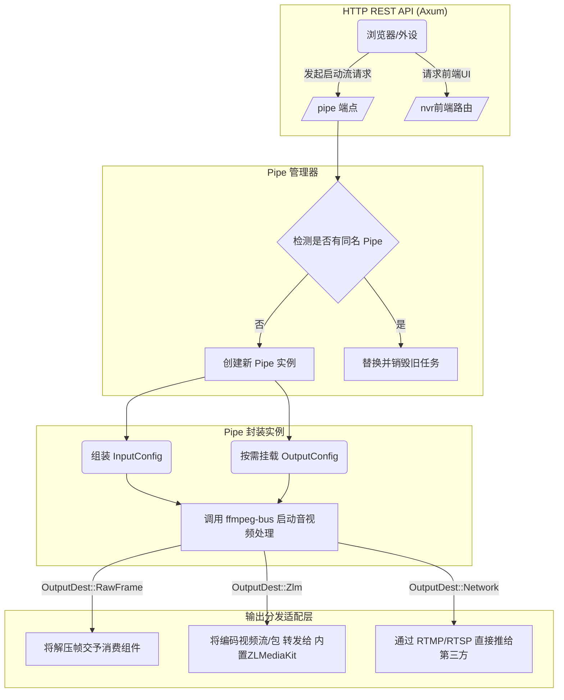

# lite-nvr 与核心管控模块文档

`lite-nvr` 是整个网络录像机（Network Video Recorder）程序的核心后端入口模块。它将音视频处理（`ffmpeg-bus`）、流媒体服务器转发（`zlm` / ZLMediaKit）、数据库（`nvr-db`）和前端 Web 界面（`nvr-dashboard`）整合在一起，提供了一套完整视频流管理和分发系统。

## 1. 工程具体功能

- **HTTP API 管理系统**：基于 `axum` 提供 RESTful API 接口，用于统一管理系统配置、设备接入、流媒体管道（Pipe）的生命周期。
- **媒体管道管理器（Pipe Manager）**：允许用户在运行时动态创建、更新和删除独立的按需音视频处理流水线（Pipe），它充当了底层的 `ffmpeg-bus` 和上层的粘合剂。
- **ZLM 流媒体服务器深度集成**：可选的内嵌 ZLMediaKit 服务端进程，当选用推流到 `zlm` 时，会自动利用内部的高速通道，将 `ffmpeg_bus` 解码或编码出库的 AnnexB 包极速推送到 ZLM 中实现 RTSP/RTMP/HLS/WebRTC 等协议分发。
- **数据库生命周期管理**：在程序主入口完成数据库建表向导和 SQLite 库的迁移（通过关联 `nvr-db`）。

## 2. 核心实现逻辑

主程序的启动流程清晰定义在 `src/main.rs` 中：
1. **初始化**：开启日志，并调用 `ffmpeg_bus::init()` 初始化 FFmpeg 环境。
2. **数据库加载**：读取配置文件参数，运行 `nvr-db` 的静态迁移文件更新 SQLite 表结构。
3. **服务启动**：
   - 启动基于 Axum 框架的外部 HTTP API 监听 (`api::start_api_server`)，同时会将构建好的 `nvr-dashboard` 前端静态页面通过 axum server `nest` 托管并分发出去。
   - 如果开启了 `zlm` 特性，将会启动内置的流媒体中继服务，侦听音视频播放请求。
4. **管道控制逻辑** (`manager.rs` 与 `media/pipe.rs`)：
   - 使用异步读写锁包装的 `HashMap<String, Arc<Pipe>>` 全局保存当前活动的视频推演流。
   - 每次创建一个 `Pipe` 都会底层实例化一个 `ffmpeg_bus::bus::Bus`，并将请求定义的输入（如 IPCamera 的本地局域网 RTSP流）和输出（如转发给 AI 识别分析的 RawFrame、丢给 web 浏览器转推的 zlm 格式）组装起来异步消费。

## 3. lite-nvr 控制流与组装架构图



## 4. 后续修改与余留核心接口

在 `lite-nvr` 层留给系统集成以及外部应用调用的余留接口：

### 管道构建器接口 (`media::pipe::PipeConfigBuilder`)
为了方便以后扩展，创建流任务完全采用可链式调用的 Builder 模式：
```rust
let config = PipeConfig::builder()
    .input_url("rtsp://home-cam:554/stream")
    .add_zlm_output(media_instance) // 将流转推给局域网流服务器
    .add_raw_frame_output(ai_sink)  // 将裸数据塞给AI行为分析管道
    .add_remux_output("rtmp://remote-cloud", "flv") // 转推到远端
    .build();

crate::manager::add_pipe("camera1", config, true).await?;
```

### ZLMediaKit 连接特化 (`forward_raw_packet_stream_to_zlm`)
- 如果直接输出给 ZLM 会引发网络封装，后端在此直接对接裸的 H.264/H.265 NALU。它包含了对视频字节流打包格式（MP4 的 `AVCC/HVCC` 向标准 `Annex B`）的动态校验和自动提取转换 (`is_annexb_packet` 和 `convert_avcc_to_annexb`)，保证无论是软编还是硬件 `nvenc` 出来的流，都可以做到零拷贝或极小转换后直接流入开源流媒体后端。

---

## 5. 日常用法与故障排查（综合运维）

后端主要起到管理调度的效果。发生异常时，排错更多依赖日志观测和 FFmpeg 探测：

### (1) Web 端无法播放 / 接口提示异常
- NVR 程序的默认 Web 界面在端口 `8080`，API 入口也在 `8080` 上。
- 如果页面无法打开，请检查是否后台在编译阶段没有执行 frontend 编译，请先到 `nvr-dashboard` 中执行 `npm run build`。

### (2) 识别异常音视频格式阻拦推流
- 若摄像头输入的是非常规 IPC 流，`ffmpeg-bus` 底层解不开时，`lite-nvr` 终端会跳出 `Pipe: add_input failed`。
- 这时应**立即**通过命令行提取一段样例流来观测问题：
  ```bash
  ffmpeg -y -i "rtsp://camera_ip_address" -vcodec copy -acodec copy -t 10 debug_dump.mp4
  ffprobe debug_dump.mp4
  ```
- 观察是否含有特殊的附加私有数据流或者不被系统默认带的 FFmpeg 编译配置支持的特殊编码格式（比如一些老款大华海康的 H.265 私有加密）。

### (3) 查看 ZLM 流服务器启动失败
- 目前带有 ZLM 服务器的模式受限于 `#[cfg(feature = "zlm")]`，如果没有在 `cargo run/build` 时附带 `--features zlm` 则启动的是精简版应用，此时 `lite-nvr` 只会进行拉流和本地磁盘保存记录，不会具备多协议并发分发网页播放的能力。
