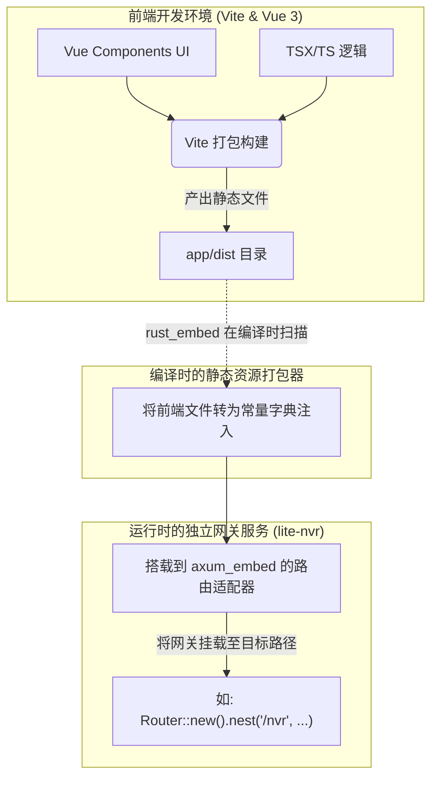

# nvr-dashboard Web 前端及网关分发文档

`nvr-dashboard` 是 Lite-NVR 项目的客户端管理面板模块。该模块由两部分构成：一个现代化的 Vue 3 静态单页应用（SPA），和一个利用 `rust_embed` 的静态服务粘合层（Rust crate，负责把前端项目挂载给 Axum 服务端）。

## 1. 工程具体功能

- **可视化的控制台 UI**：提供设备通道管理、视频监控播放、流媒体生命周期（Pipe）监控等可视化操作界面。
- **现代化技术栈**：使用 Vue 3 (Composition API)、TypeScript 进行开发，结合 Vite 作为前端工程化与极速热重载构建工具。UI 框架选用 `PrimeVue`。
- **零外部依赖打包分发（单运行文件机制）**：通过静态资源内嵌机制，将打包编译好的静态产物 `.js`, `.css`, `index.html` 在编译期直接打入最终的 Rust 二进制程序（`lite-nvr` 执行档）中。服务器部署时无需额外部署 Nginx，只要启动单一可执行文件即可提供所有能力。

## 2. 核心实现逻辑与目录结构

整个模块内包含一个 Node.js 环境工作区和一个 Rust Create，它们互不干扰但由路径建立联结。

### 前端应用逻辑 (`app/` 目录)
这是一个标准的基于 Vite创建的工程：
- **`package.json`**: 负责装载前端依赖项，如 `vue`, `primevue`, `vue-router` 等。
- **编译时行为**: `npm run build` 命令会将所有的 `.ts` / `.vue` 文件打包并压缩到 `./app/dist/` 文件夹。需要注意，`VITE_BASE_URL` 被设置为 `/nvr/`，用以适配后端的虚拟挂载前缀。

### 后端挂载逻辑 (`src/lib.rs` 目录)
这里的入口库提供了一个直接对接 Axum 后端的 `app_router()` 构造器：
- **`rust_embed::RustEmbed`**: 其中的 `#[folder = "app/dist/"]` 宏指令会在 Rust `cargo build` 执行期间读取构建好的前端页面资源并转化为二进制数据注入到代码段中。
- **Axum 路由与单页应用 Fallback 反向代理**:
  采用 `axum_embed::ServeEmbed` 统一处理对前端资源的 GET 请求。如果匹配不到存在的文件或 API 路由（例如用户在地址栏强行刷新的带参页面），其内部设置了 `FallbackBehavior::Ok` ，将请求重新转发给 `index.html`，这是典型的为 SPA 设计的前端路由重定向支持策略。

## 3. 架构协同与服务交互图

## 4. 后续开发与排障指南

### 1. 为什么页面显示 404 Not Found？
前端所有的资源都是编译时捆绑的，如果在运行 Lite-NVR 后访问 `/nvr` 出现 404：
> **故障原因**：开发时仅利用了 Cargo 进行后端编译，而在编译 Rust 之前，忘了构建前端的 `dist`。导致 `rust_embed` 抓取了一个空的文件夹，或者挂载的文件陈旧没更新。
> **修复流程**：进入 `nvr-dashboard/app` 路径下，先执行 `npm install`，紧接着执行 `npm run build`。然后再退回主目录重新运行 `cargo build` 或 `cargo run`。

### 2. 前端本地联调与跨域 (CORS) 问题
由于纯前后端分离的设定，可以直接在开发期抛开后端的 `rust_embed` 进行联调：
1. 保证本机的 `lite-nvr` 进程运行并且 API 服务占用了默认的 `8080` 端口。
2. 进入 `nvr-dashboard/app/` 并运行 `npm run dev` 启动独立的 Vite DevServer（通常运行在 `5173` 等端口）。
3. 这时在浏览器中打开 `localhost:5173`。这里如果有 API 发送请求碰见跨域问题，请前往前端项目里修改 `vite.config.ts` 下的 `proxy` 设置，将其劫持代理指向本机的 `8080` 后端服务即可。

### 3. 前端修改了 Base Path（如 `/nvr` 变更为根目录 `/`）
如果系统业务需求修改了外抛的前端可达 URL，需要同步更改两处：
1. `lite-nvr` 里面挂载前端的 `nest_service("/nvr", ...)`。
2. 前端中的全局 `vite.config.ts` （或 `package.json` 中的构建脚本变量）下定义的静态资源挂载 `VITE_BASE_URL`，否则打出来的资源请求路径全会找错位置。
